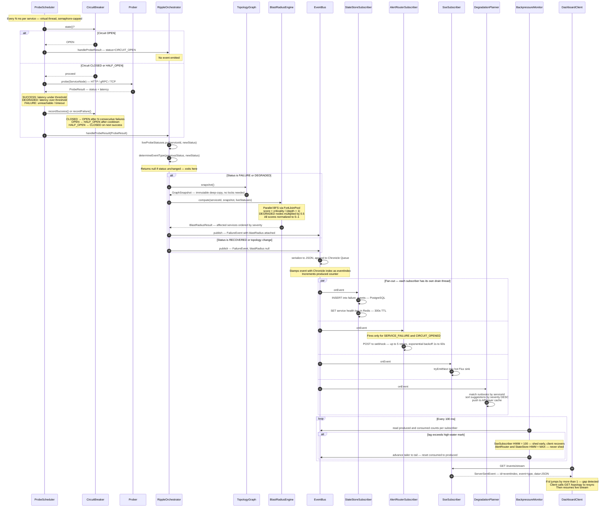
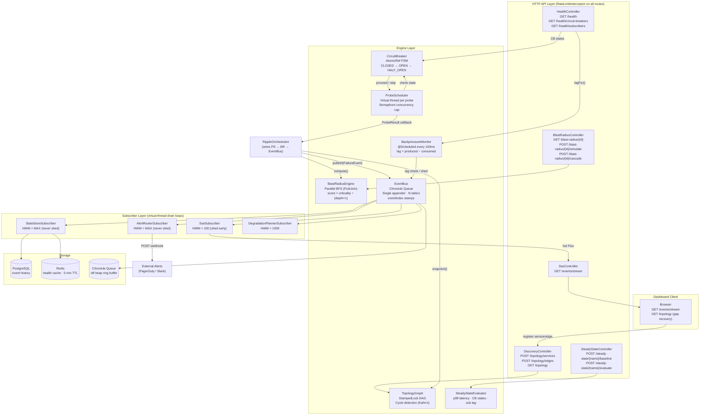

# Ripple — Architecture Diagrams

Two complementary views of how the system works. Read Diagram 1 for the runtime flow, Diagram 2 for the structural map.

---

## Diagram 1 — End-to-End Event Lifecycle

How a single probe tick becomes a live SSE event on the dashboard. Follow the numbered steps.

---

## Diagram 2 — Structural Layers

What each layer owns and how the two main flows (probe loop and SSE delivery) connect them.

---

## Key Insight

Every component from `ProbeScheduler` through `BlastRadiusEngine` exists to produce one well-formed `FailureEvent` with a correct `eventIndex`. Everything after `EventBus.publish()` is fan-out — each subscriber reads the same event independently at its own pace, without blocking any other.

The two short-circuit exits that prevent unnecessary work:
1. **Circuit breaker OPEN** → probe skipped entirely, no network call made
2. **Status unchanged** → `determineEventType()` returns null, no event published
